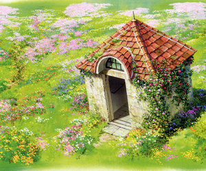
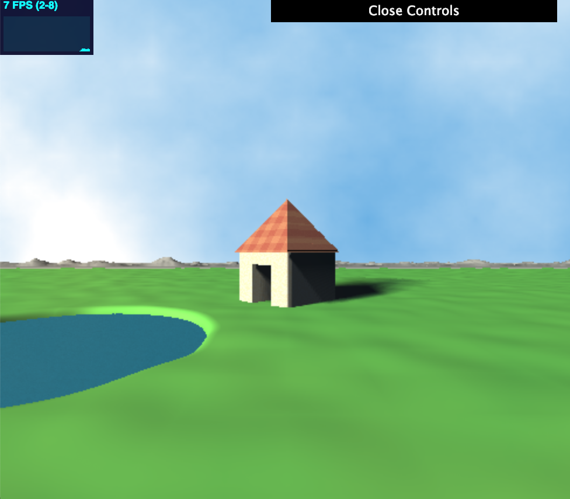

# CIS 566 Homework 3: Environment Setpiece
## Catherine Yang, PennKey: catyang

## Link: https://catherine-yang.com/hw03-environment-setpiece/

---
## References
- IQ- SDF combination operations and primitives: http://iquilezles.org/www/articles/distfunctions/distfunctions.htm
- Jamie Wong- Ray Marching Techniques and Normal Calculations: http://jamie-wong.com/2016/07/15/ray-marching-signed-distance-functions/
- Ray Marching: CIS 460 and CIS 566 slides
- Toolbox Functions: Toolbox slides
- Soft Shadows: https://iquilezles.org/www/articles/rmshadows/rmshadows.htm
- Noise Functions from ShaderToy projects: https://www.shadertoy.com/view/XdsGD7, https://www.shadertoy.com/view/MsB3WR
- Lights: https://www.shadertoy.com/view/td2GD3

---
## Techniques

- SDFs: Each element in the scene is made of its own SDF. The house is made of SDF primitives blended together (sdBox, sdRoundBox, sdTriPrism).

- Animation: The sky is a combination of a sky color and clouds. The clouds are created using FBM that uses the time in its calculation. The water uses time as an input in the noise function it uses to adjust the geometry;

- Noise: The water, hills, and grass all use noise to change geometry. The roof and house use noise functions for their colors.

- Lighting: There are three light sources in the scene of slightly different shades.

- Soft Shadows: https://iquilezles.org/www/articles/rmshadows/rmshadows.htm

- Other: The clouds are low-lying so they cause the ground to be cloudy.

---
## Inspiration

I wanted to recreate a Miyazaki-style landscape, specifically using these scenes from Howl's Moving Castle. 

I wanted to add more details to the building, make the grass more realistic, have the lake be reflective, and make better mountains :/

---

not quite

